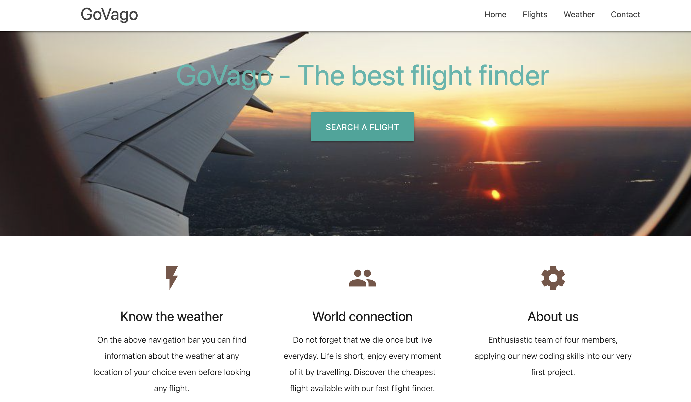

# 07 Project 1: Interactive Front-End Application
THE BLUE TEAM

| Michael D-Viau
| Daniel Ruíz
| Soobin Lim
| Marco Torres

## Description

GoVago can be used to find the cheapest flights between North America (México, United States and Canada) and check the weather conditions in your destination.

## Project Requirements

You and your group will use everything you’ve learned over the past six units to create a real-world front-end application that you’ll be able to showcase to potential employers. The user story and acceptance criteria will depend on the project that you create, but your project must fulfil the following requirements:

* Use a CSS framework other than Bootstrap.

* Be deployed to GitHub Pages.

* Be interactive (i.e., accept and respond to user input).

* Use at least two [server-side APIs]

* Does not use alerts, confirms, or prompts (use modals).

* Use client-side storage to store persistent data.

* Be responsive.

* Have a polished UI.

* Have a clean repository that meets quality coding standards (file structure, naming conventions, follows best practices for class/id naming conventions, indentation, quality comments, etc.).

* Have a quality README (with unique name, description, technologies used, screenshot, and link to deployed application).

Screenshot preview:

Deployment link:

https://marcotorr.github.io/First_Project/index.html
